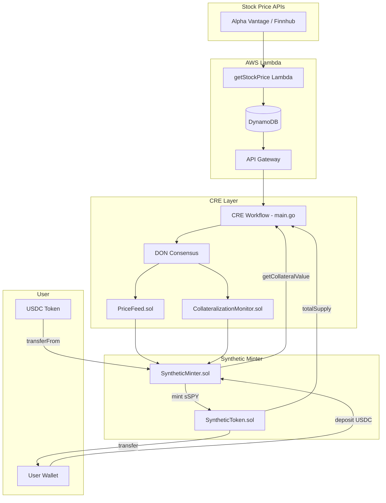

# Design Document: Synthetic Asset Minter with CRE Integration

## Overview

This design describes a Synthetic Asset Minter that enables users to deposit USDC as collateral and mint synthetic ETF tokens (e.g., sSPY representing the S&P 500). The system integrates with Chainlink Runtime Environment (CRE) oracle feeds that fetch real-time stock prices from public APIs (Alpha Vantage, Yahoo Finance, etc.) via DON consensus.

### Data Flow

```
Public Stock APIs (Alpha Vantage, Yahoo, etc.)
           ↓
    CRE Workflow (Go/WASM)
           ↓
    DON Consensus
           ↓
    PriceFeed.sol (on-chain)
           ↓
    SyntheticMinter.sol ← reads price
           ↓
    User mints/burns sSPY
```

## Architecture



### Data Flow

1. **Lambda fetches stock price** from Alpha Vantage/Finnhub → stores in DynamoDB → exposes via API Gateway
2. **CRE workflow** (every N seconds):
   - Reads stock price from Lambda API Gateway
   - Reads `SyntheticMinter.getCollateralValue()` from on-chain
   - Reads `SyntheticToken.totalSupply()` from on-chain
   - Calculates global collateralization ratio
   - Writes price to `PriceFeed.sol`
   - Writes collateral metrics to `CollateralizationMonitor.sol`
3. **User mints/burns** synthetic tokens, with minter checking CRE feeds for price and protocol health

## Components and Interfaces

### ICREPriceFeed Interface

Minimal interface matching the existing `PriceFeed.sol` contract:

```solidity
// SPDX-License-Identifier: MIT
pragma solidity ^0.8.20;

interface ICREPriceFeed {
    /// @notice Returns the latest price and timestamp
    /// @return price The asset price (8 decimals, e.g., 18500000000 = $185.00)
    /// @return timestamp Unix timestamp when price was updated
    function getLatestPrice() external view returns (uint256 price, uint256 timestamp);
}
```

### ICRECollateralMonitor Interface

Minimal interface matching the existing `CollateralizationMonitor.sol`:

```solidity
// SPDX-License-Identifier: MIT
pragma solidity ^0.8.20;

interface ICRECollateralMonitor {
    struct CollateralData {
        uint256 price;
        uint256 reserves;
        uint256 ratio;
        uint256 timestamp;
        bool isHealthy;
    }
    
    /// @notice Returns the latest collateral health data
    function getLatestData() external view returns (CollateralData memory);
}
```

### SyntheticMinter Contract

The main contract managing collateral and synthetic token minting:

```solidity
contract SyntheticMinter is Ownable, Pausable, ReentrancyGuard {
    // Feed interfaces
    ICREPriceFeed public priceFeed;
    ICRECollateralMonitor public collateralMonitor;
    
    // Tokens
    IERC20 public immutable usdc;
    SyntheticToken public immutable syntheticToken;
    
    // Risk parameters
    uint256 public minCollateralizationRatio = 150; // 150%
    uint256 public mintFeeBps = 30;                 // 0.3%
    uint256 public stalenessWindow = 3600;          // 1 hour
    
    // User positions
    mapping(address => uint256) public totalCollateral;
    mapping(address => uint256) public lockedCollateral;
    
    // Fee accounting
    address public feeRecipient;
    uint256 public accumulatedFees;
}
```

### SyntheticToken Contract

A simple ERC20 with mint/burn controlled by the minter:

```solidity
contract SyntheticToken is ERC20, Ownable {
    address public minter;
    
    modifier onlyMinter() {
        require(msg.sender == minter, "Only minter");
        _;
    }
    
    function mint(address to, uint256 amount) external onlyMinter {
        _mint(to, amount);
    }
    
    function burn(address from, uint256 amount) external onlyMinter {
        _burn(from, amount);
    }
}
```

## Data Models

### User Position

```solidity
// Stored per-user
totalCollateral[user]   // Total USDC deposited by user
lockedCollateral[user]  // USDC currently backing minted tokens

// Derived (not stored)
availableCollateral = totalCollateral - lockedCollateral
syntheticBalance = syntheticToken.balanceOf(user)
positionValue = syntheticBalance * currentPrice / 10^8
collateralRatio = (lockedCollateral * 100) / positionValue
```

### Price Data (from CRE)

```solidity
// From PriceFeed.sol
price     // Stock price in USD with 8 decimals (e.g., 18500000000 = $185.00)
timestamp // Unix timestamp of last update

// From CollateralizationMonitor.sol
ratio     // Global protocol collateralization ratio (percentage)
isHealthy // Whether protocol meets minimum health threshold
```

### Constants

```solidity
PRICE_DECIMALS = 8        // CRE price feed decimals
USDC_DECIMALS = 6         // USDC token decimals
SYNTHETIC_DECIMALS = 18   // Synthetic token decimals
BPS_DENOMINATOR = 10000   // Basis points denominator
```

## Correctness Properties

*A property is a characteristic or behavior that should hold true across all valid executions of a system—essentially, a formal statement about what the system should do. Properties serve as the bridge between human-readable specifications and machine-verifiable correctness guarantees.*

### Property 1: Deposit Increases Collateral Balance

*For any* user with sufficient USDC balance and *for any* valid deposit amount > 0, after calling `depositCollateral(amount)`, the user's `totalCollateral` SHALL increase by exactly `amount` and the contract's USDC balance SHALL increase by `amount`.

**Validates: Requirements 4.1, 4.3, 4.5**

### Property 2: Collateral Accounting Invariant

*For any* user at any point in time, `totalCollateral[user] >= lockedCollateral[user]` SHALL hold, and `availableCollateral = totalCollateral - lockedCollateral` SHALL be non-negative.

**Validates: Requirements 4.3, 4.4**

### Property 3: Withdraw Decreases Available Collateral

*For any* user with available collateral >= amount, after calling `withdrawCollateral(amount)`, the user's `totalCollateral` SHALL decrease by `amount` and the user's USDC balance SHALL increase by `amount`.

**Validates: Requirements 4.6**

### Property 4: Owner-Only Access Control

*For any* non-owner address calling `setPriceFeed`, `setCollateralMonitor`, `setMinCollateralizationRatio`, `setMintFeeBps`, `setStalenessWindow`, `pause`, or `unpause`, the transaction SHALL revert.

**Validates: Requirements 5.1, 5.2, 6.5, 10.1**

### Property 5: Staleness Check Rejects Old Data

*For any* operation requiring price data (mint, burn, view functions), if `block.timestamp - priceTimestamp > stalenessWindow`, the operation SHALL revert with "Price feed stale".

**Validates: Requirements 7.1, 7.2**

### Property 6: Unhealthy Protocol Blocks Operations

*For any* mint operation, if `collateralMonitor.getLatestData().isHealthy == false`, the transaction SHALL revert with "Protocol unhealthy".

**Validates: Requirements 7.4**

### Property 7: Mint Collateral Calculation

*For any* mint of `syntheticAmount` tokens at price `p`, the required collateral SHALL equal `(syntheticAmount * p * minCollateralizationRatio) / (100 * 10^PRICE_DECIMALS)`, adjusted for decimal differences between USDC (6) and synthetic (18).

**Validates: Requirements 8.3**

### Property 8: Insufficient Collateral Blocks Mint

*For any* user attempting to mint where `requiredCollateral > availableCollateral`, the transaction SHALL revert with "Insufficient collateral".

**Validates: Requirements 8.4**

### Property 9: Mint Fee Deduction

*For any* mint with `mintFeeBps > 0`, the user SHALL receive `syntheticAmount - (syntheticAmount * mintFeeBps / 10000)` tokens, and `accumulatedFees` SHALL increase by the fee amount.

**Validates: Requirements 8.7**

### Property 10: Burn Releases Proportional Collateral

*For any* user burning `burnAmount` of their `totalSynthetic` balance, the released collateral SHALL equal `lockedCollateral[user] * burnAmount / totalSynthetic`.

**Validates: Requirements 9.2**

### Property 11: Partial Burn Improves or Maintains CR

*For any* partial burn (burning less than full position), the user's collateralization ratio after burn SHALL be >= their ratio before burn.

**Validates: Requirements 9.5**

### Property 12: Pause Blocks Mutable Operations

*For any* call to `mint()`, `burn()`, or `depositCollateral()` while `paused() == true`, the transaction SHALL revert.

**Validates: Requirements 10.2**

### Property 13: Withdraw Allowed While Paused

*For any* user with available collateral, `withdrawCollateral()` SHALL succeed even when `paused() == true`.

**Validates: Requirements 10.5**

### Property 14: Collateral Ratio Calculation

*For any* user with a position, `getUserCollateralRatio(user)` SHALL return `(lockedCollateral[user] * 100 * 10^PRICE_DECIMALS) / (syntheticBalance * currentPrice)`.

**Validates: Requirements 12.1**

### Property 15: Max Mintable Boundary

*For any* user, calling `mint(getMaxMintable(user))` SHALL succeed, and calling `mint(getMaxMintable(user) + 1)` SHALL revert with "Insufficient collateral".

**Validates: Requirements 12.3**

## Error Handling

### Revert Conditions

| Condition | Error Message |
|-----------|---------------|
| Feed address is zero | "Invalid feed address" |
| Price feed stale | "Price feed stale" |
| Collateral feed stale | "Collateral feed stale" |
| Price is zero | "Invalid price" |
| Protocol unhealthy | "Protocol unhealthy" |
| Insufficient collateral | "Insufficient collateral" |
| Insufficient balance | "Insufficient balance" |
| Below min collateralization | "Below min collateralization" |
| Contract paused | "Pausable: paused" |
| Not owner | "Ownable: caller is not the owner" |
| Reentrancy detected | "ReentrancyGuard: reentrant call" |
| Invalid fee (> 1000 bps) | "Fee exceeds maximum" |

### Events

```solidity
event CollateralDeposited(address indexed user, uint256 amount, uint256 priceAtDeposit);
event CollateralWithdrawn(address indexed user, uint256 amount);
event SyntheticMinted(address indexed user, uint256 amount, uint256 priceUsed, uint256 collateralRatio);
event SyntheticBurned(address indexed user, uint256 amount, uint256 priceUsed, uint256 collateralReleased);
event FeedUpdated(string indexed feedType, address oldAddress, address newAddress);
event RiskParamsUpdated(string indexed param, uint256 oldValue, uint256 newValue);
event FeesCollected(address indexed recipient, uint256 amount);
```

## Testing Strategy

### Unit Tests

Unit tests verify specific examples and edge cases:

1. **Feed Configuration**
   - Setting valid feed addresses
   - Rejecting zero addresses
   - Owner-only access

2. **Deposit/Withdraw**
   - Successful deposit increases balance
   - Withdraw of available collateral
   - Cannot withdraw locked collateral

3. **Mint Edge Cases**
   - Mint with exact available collateral
   - Mint with fee deduction
   - Reject mint when paused

4. **Burn Edge Cases**
   - Full position burn
   - Partial burn
   - Burn with price change

5. **Staleness**
   - Fresh data accepted
   - Stale data rejected at boundary

### Property-Based Tests

Property tests use randomized inputs to verify universal properties. We will use Foundry's fuzzing capabilities.

**Test Configuration:**
- Minimum 100 iterations per property test
- Each test tagged with: `Feature: cre-stablecoin-integration, Property N: [property name]`

**Properties to Test:**
1. Deposit/withdraw accounting (Properties 1, 2, 3)
2. Access control (Property 4)
3. Staleness validation (Property 5)
4. Mint calculations (Properties 7, 8, 9)
5. Burn calculations (Properties 10, 11)
6. Pause behavior (Properties 12, 13)
7. View function correctness (Properties 14, 15)

### Mock Contracts

```solidity
contract MockPriceFeed is ICREPriceFeed {
    uint256 public price;
    uint256 public timestamp;
    
    function setPrice(uint256 _price, uint256 _timestamp) external {
        price = _price;
        timestamp = _timestamp;
    }
    
    function getLatestPrice() external view returns (uint256, uint256) {
        return (price, timestamp);
    }
}

contract MockCollateralMonitor is ICRECollateralMonitor {
    CollateralData public data;
    
    function setData(CollateralData memory _data) external {
        data = _data;
    }
    
    function getLatestData() external view returns (CollateralData memory) {
        return data;
    }
}
```

### Test Scenarios

1. **Happy Path**: Deposit → Mint → Price increases → Burn → Withdraw
2. **Price Drop**: Mint at high price → Price drops → Verify CR calculation
3. **Stale Feed**: Set timestamp in past → Verify operations revert
4. **Protocol Unhealthy**: Set isHealthy=false → Verify mint blocked
5. **Pause/Unpause**: Pause → Verify blocked → Unpause → Verify restored
6. **Fee Collection**: Mint with fee → Verify fee accounting → Collect fees
