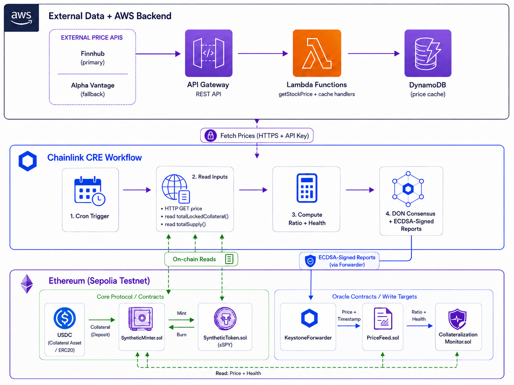

# Tokenized Fund on AWS with Chainlink CRE

A demonstration of integrating AWS serverless infrastructure with the Chainlink Runtime Environment (CRE) to power a tokenized fund protocol. Users deposit USDC as collateral to mint tokens that track the price of an S&P 500 ETF (sSPY), with real-time pricing sourced from public stock APIs.

Here, **synthetic** means the sSPY token tracks the *price* of the S&P 500 via an on-chain oracle rather than being backed by actual shares. The fund's value is replicated with USDC collateral instead of holding the underlying basket.

**Authored by: Simon Goldberg and David Dornseifer**

> This sample is part of the
> [AWS Digital Asset Samples](https://aws-samples.github.io/aws-digital-asset-samples/)
> collection.

## Contents

- [Architecture](#architecture)
- [How It Works](#how-it-works)
- [Project Structure](#project-structure)
- [Prerequisites](#prerequisites)
- [Quick Start](#quick-start-one-command)
- [Using the Protocol](#using-the-protocol)
- [Testing](#testing)
- [Web UI](#web-ui)
- [Component Documentation](#component-documentation)
- [Security](#security)
- [License](#license)

## Architecture



## How It Works

1. **AWS backend** — Lambda fetches SPY prices from Finnhub/Alpha Vantage, caches them in DynamoDB, and serves them via an API-key-protected API Gateway.
2. **CRE workflow** (every 30s) — reads the price from Lambda and collateral/supply from the contracts, computes the collateralization ratio, then writes price + health back on-chain through DON consensus.
3. **Users** — deposit USDC into SyntheticMinter to mint sSPY (150% collateralized), and burn sSPY to unlock their collateral.

## Project Structure

```
├── sample-cre-pricefeeds-por/          # AWS + CRE infrastructure
│   ├── price-feed-por-dynamodb-crud/   # Lambda handlers (TypeScript)
│   └── aws-oracle-cre/                 # CRE workflow + oracle contracts
│
└── synthetic-asset-minter/             # Minting protocol (Foundry)
```

## Prerequisites

| Tool | Version | Installation |
|------|---------|--------------|
| AWS CLI | Latest | [Install](https://docs.aws.amazon.com/cli/latest/userguide/getting-started-install.html) |
| AWS SAM CLI | Latest | [Install](https://docs.aws.amazon.com/serverless-application-model/latest/developerguide/install-sam-cli.html) |
| CRE CLI | v1.0.3+ | [Install](https://docs.chain.link/cre/getting-started/cli-installation) |
| Node.js | 20+ | [Install](https://nodejs.org/) |
| esbuild | Latest | `npm install -g esbuild` |
| Go | 1.25.3+ | [Install](https://go.dev/dl/) |
| Foundry | Latest | [Install](https://book.getfoundry.sh/getting-started/installation) |
| jq | Latest | `brew install jq` (macOS) or `apt-get install jq` (Linux) |

**Also needed:**
- AWS credentials configured (`aws configure`)
- CRE authenticated (`cre login`)
- Sepolia ETH for gas ([Faucet](https://faucets.chain.link))
- Stock API key from [Finnhub](https://finnhub.io/) and/or [Alpha Vantage](https://www.alphavantage.co/)

## Quick Start (One Command)

```bash
cp .env.example .env
# Edit .env with your PRIVATE_KEY (with 0x prefix) and FINNHUB_API_KEY

./deploy-e2e.sh
```

The script handles: prerequisites check → AWS Lambda → CRE oracle contracts → minter contracts → wiring → CRE config → integration test.

All deployed addresses are saved to `deployed-addresses.json`.

```bash
./deploy-e2e.sh --help              # Show all options
./deploy-e2e.sh --skip-lambda       # Skip AWS deployment (if already done)
./deploy-e2e.sh --skip-cre          # Skip CRE contract deployment
./deploy-e2e.sh --test-only         # Only run integration test
```

<details>
<summary><strong>Manual Deployment</strong> (click to expand)</summary>

If you prefer step-by-step control, each component has its own deploy script:

```bash
# 1. Deploy AWS Lambda (API Gateway + DynamoDB)
cd sample-cre-pricefeeds-por/price-feed-por-dynamodb-crud
export FINNHUB_API_KEY=<your-key>
./deploy.sh

# 2. Deploy CRE oracle contracts (PriceFeed + CollateralizationMonitor)
cd sample-cre-pricefeeds-por/aws-oracle-cre/contracts/evm
export PRIVATE_KEY=<your-private-key>
./deploy.sh    # Also sets KeystoneForwarder and updates config.staging.json

# 3. Deploy minter contracts (SyntheticToken + SyntheticMinter)
cd synthetic-asset-minter
export PRIVATE_KEY=<your-private-key>
./deploy.sh    # OWNER_ADDRESS auto-derived from PRIVATE_KEY

# 4. Wire CRE feeds into minter
export RPC_URL=https://ethereum-sepolia-rpc.publicnode.com
cast send <SyntheticMinter> "setPriceFeed(address)" <PriceFeed> \
  --rpc-url $RPC_URL --private-key $PRIVATE_KEY
cast send <SyntheticMinter> "setCollateralMonitor(address)" <CollateralizationMonitor> \
  --rpc-url $RPC_URL --private-key $PRIVATE_KEY

# 5. Configure and run CRE workflow
cd sample-cre-pricefeeds-por/aws-oracle-cre
./set-api-key.sh                    # Populates API key + URL in .env and config
# Edit .env: CRE_ETH_PRIVATE_KEY=<64-hex-chars-NO-0x-prefix>
cre login
cre generate-bindings evm
cre workflow simulate ./api-oracle --target staging-settings --broadcast
```

> **Note:** The CRE workflow requires the `API_KEY` secret (mapped via `secrets.yaml` to `API_KEY_VALUE` env var in `.env`). Without it, API calls return 403.

</details>

## Using the Protocol

After deployment, interact with the minter. See [synthetic-asset-minter/README.md](./synthetic-asset-minter/README.md#user-operations) for full commands, or run the automated test:

```bash
cd synthetic-asset-minter
export PRIVATE_KEY=<your-private-key>
./test-integration.sh
```

## Testing

```bash
# Foundry unit tests
cd synthetic-asset-minter && forge test -vvv

# Lambda tests
cd sample-cre-pricefeeds-por/price-feed-por-dynamodb-crud && npm test
```

## Web UI

A browser-based dashboard for interacting with the deployed protocol. Connects to Sepolia via MetaMask.

### Running

```bash
cd ui
./serve.sh          # or: python3 server.py
# Open http://localhost:3000
```

### Features

| Panel | What it shows |
|-------|---------------|
| **SPY/USD Oracle Price** | Live on-chain price from the CRE PriceFeed contract, freshness indicator (green/orange/red based on staleness window) |
| **Protocol Status** | Global collateralization ratio, TVL in USDC, total sSPY supply, health badge |
| **Data Flow Pipeline** | Animated visualization of the full price path: Finnhub → Lambda → CRE DON → Sepolia contracts |
| **Trade** | Tabbed interface to Deposit USDC, Mint sSPY, Burn sSPY, or Withdraw USDC — with live fee/collateral previews |
| **Your Position** | Per-wallet breakdown: total/locked/available collateral, sSPY balance, position value, personal CR with risk bar |
| **Activity** | Recent on-chain events (deposits, mints, burns, withdrawals) with Etherscan links |

### Requirements

- **MetaMask** (or any injected wallet) connected to **Sepolia testnet**
- Contracts must be deployed first — the UI merges addresses from `deployed-addresses.json` (full e2e deploy) or `oracle-addresses.json` (standalone oracle deploy), both auto-generated
- The **Update Oracle Feeds** button triggers a CRE workflow via `server.py` (requires `cre login` and `aws-oracle-cre/.env`, also auto-generated by deploy scripts)

## Component Documentation

| Component | README | Description |
|-----------|--------|-------------|
| Minter Protocol | [synthetic-asset-minter/](./synthetic-asset-minter/README.md) | Contracts, user operations, risk parameters |
| AWS Lambda | [price-feed-por-dynamodb-crud/](./sample-cre-pricefeeds-por/price-feed-por-dynamodb-crud/README.md) | API endpoints, troubleshooting |
| CRE Workflow | [aws-oracle-cre/](./sample-cre-pricefeeds-por/aws-oracle-cre/README.md) | Workflow config, secrets, simulation |
| Oracle Contracts | [contracts/evm/](./sample-cre-pricefeeds-por/aws-oracle-cre/contracts/evm/README.md) | PriceFeed, CollateralizationMonitor |

## Security

- **Reentrancy Protection**: OpenZeppelin ReentrancyGuard on all state-changing functions
- **Pause Functionality**: Owner can pause minting/burning in emergencies
- **Staleness Checks**: Rejects oracle data older than configured window (default 1 hour)
- **Health Checks**: Blocks minting when protocol collateralization is unhealthy
- **Access Control**: Admin functions restricted to contract owner

To report a security issue, see [CONTRIBUTING](CONTRIBUTING.md#security-issue-notifications).

## License

This library is licensed under the MIT-0 License. See the [LICENSE](LICENSE) file.
